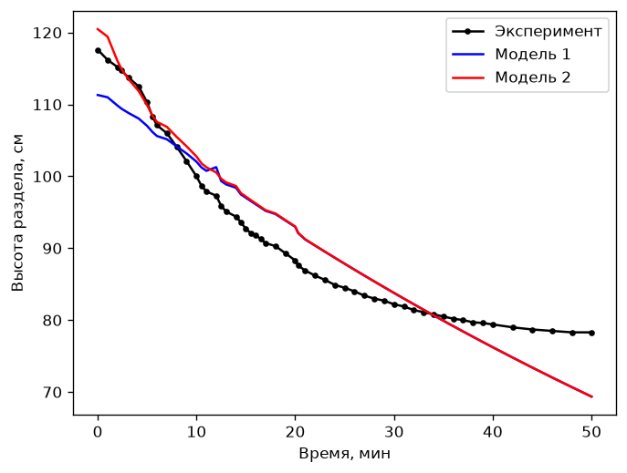
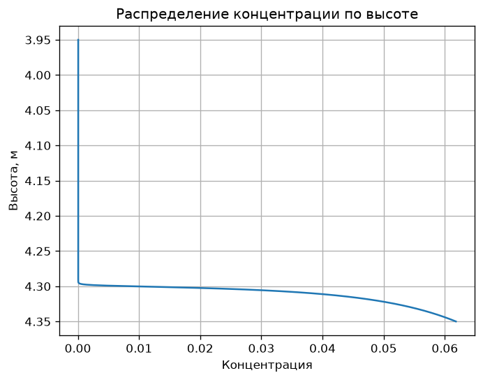

# Анализ флокуляции и осаждения

Курсовая работа по научным вычислениям для **стадии сгущения / осветления в
процессе Байера** (производство глинозёма): как флокулированная пульпа красного
шлама осаждается в пастовом сгустителе и насколько эффективно противоточная
промывочная цепочка отмывает растворённую щёлочь.

Всё — на чистом NumPy / SciPy: подгонка кривых, линейные системы, интегрирование
ОДУ (Рунге — Кутта и Симпсон) и популяционно-балансовая модель роста флокул.
Ни фреймворков, ни ноутбука — каждый скрипт это отдельное небольшое исследование.

## Скрипты

| Скрипт | На какой вопрос отвечает | Метод |
|--------|--------------------------|-------|
| `src/settling_curve_fit.py` | постоянная времени уплотнения по кривой периодического осаждения | двухэкспоненциальная подгонка, `scipy.optimize.curve_fit` |
| `src/first_order_response_fit.py` | постоянная времени апериодического звена 1-го порядка + R² | `curve_fit` + R² по Пирсону |
| `src/settling_curves_plot.py` | измеренная vs модельная высота раздела фаз | приведение к общей оси времени, наложение |
| `src/ccd_wash_train.py` | концентрация металла по ступеням CCD, эффективность отмывки | аналитический противоточный баланс |
| `src/wash_train_sodium_balance.py` | концентрация Na₂O в каждой из 5 ступеней промывки | линейная система `A·c = b`, `numpy.linalg.solve` |
| `src/floc_population_balance.py` | средний диаметр флокул по распределению частиц | 20-классовая модель агрегации/дробления, `scipy.integrate.odeint` |
| `src/thickener_profile_rk4.py` | профиль концентрации твёрдого по высоте + чистота слива | ОДУ осаждения/уплотнения, RK4 |
| `src/thickener_profile_simpson.py` | тот же профиль, другой интегратор | составная формула Симпсона |

## Поток данных

```
data/particle_size_distribution.csv
        │
        ▼
src/floc_population_balance.py ──► data/mean_floc_diameter.json
                                        │
config.py (константы установки) ───────┤
                                        ▼
                        src/thickener_profile_simpson.py ──► figures/
```

`config.py` хранит общую геометрию сгустителя и свойства потоков. В исходном
проекте эти величины передавались между скриптами через бинарный SQLite-файл,
который не воспроизводился (и успел повредиться); теперь это читаемый Python-модуль
плюс одна небольшая передача через JSON.

## Запуск

```bash
python -m venv .venv && source .venv/bin/activate
pip install -r requirements.txt

# порядок важен только для двух скриптов, которые обмениваются данными:
python src/floc_population_balance.py        # пишет data/mean_floc_diameter.json
python src/thickener_profile_simpson.py      # читает его обратно

# остальные независимы:
python src/settling_curve_fit.py
python src/first_order_response_fit.py
python src/settling_curves_plot.py
python src/ccd_wash_train.py
python src/wash_train_sodium_balance.py
python src/thickener_profile_rk4.py
```

Графики пишутся в `figures/`, объёмный числовой вывод — в `outputs/`
(в `.gitignore`). Отрисовка использует неинтерактивный бэкенд `Agg`, поэтому
скрипты работают на машине без дисплея без изменений.

## Некоторые результаты

* Промывочная цепочка (`wash_train_sodium_balance.py`): Na₂O падает с 38.0 до
  1.45 г/л за 5 ступеней, ≈ 99 % отмывки.
* Апериодическое звено (`first_order_response_fit.py`): T₁ ≈ 49.4, R² ≈ 0.91.
* Популяционный баланс флокул (`floc_population_balance.py`): средний диаметр по
  де Брукеру ≈ 0.0102 м для заданного распределения.




## Статус

Исследовательский / учебный код. Численные модели оставлены как были написаны для
работы; эта чистка только реорганизовала файлы, убрала бинарную БД и мусор IDE,
сделала каждый скрипт запускаемым без дисплея и задокументировала назначение
каждого.

## Стек

Python · NumPy · SciPy (`optimize`, `integrate`, `linalg`) · pandas · matplotlib
